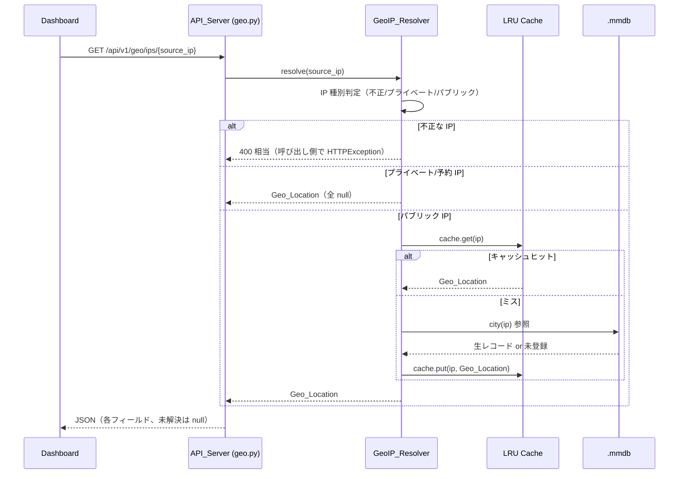
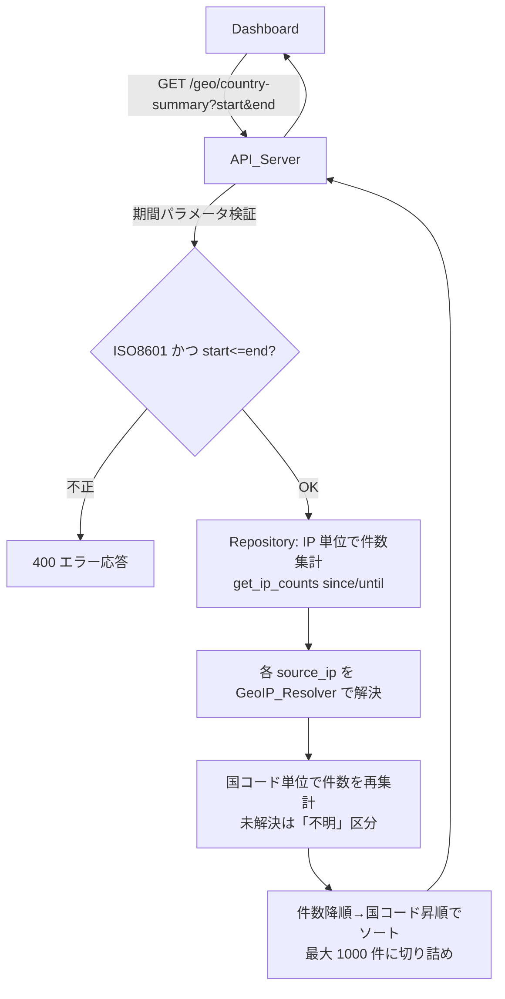

# Design Document

## Overview

本設計は、攻撃イベントの送信元 IP（`source_ip`）を MaxMind GeoLite2 データベースで地理情報（Geo_Location）に変換し、Dashboard 上で可視化する機能（`4-feat-geoip-ip-location`）を定義する。

要件で合意済みの中核方針は次の通り。

- **オンザフライ解決**: 地理情報は永続保存せず、API リクエストのたびに `GeoIP_Resolver` が `source_ip` から都度解決する。
- **スキーマ不変**: `attack_events` テーブルへの列追加・マイグレーションは行わない。
- **バックフィル不要**: 過去データも記録時期に関わらず `source_ip` を都度解決するため、新規データと区別なく分析・集計・表示の対象になる。
- **性能対策**: `GeoIP_Resolver` にプロセス内メモリキャッシュ（LRU）を設け、`.mmdb` はメモリ効率のよいリーダー（`geoip2` / `maxminddb`）で読み込む。
- **フェイルセーフ**: `.mmdb` 不在・破損・未解決・不正 IP のいずれの場合も例外で処理を止めず、地理情報なし（各フィールド null）を返す。

本フィーチャーは Phase 3（Security Intelligence）の GeoIP ジオロケーション機能に相当する。既存の `analysis` レイヤー、`core/config.py`、`api/routes/analysis.py`、フロントエンドの型・hooks・components の構成とスタイルに合わせて実装する。

### 設計上の主要判断とその根拠

| 判断 | 内容 | 根拠 |
|------|------|------|
| Resolver の配置 | `src/honeywatch/analysis/geoip.py` に新設 | structure steering の `analysis/geoip.py` 記載に合致。分析ロジックは analysis 層に集約する方針。 |
| ロードのタイミング | アプリ起動時（lifespan）に 1 回ロードしシングルトンで注入 | `.mmdb` のロードは重いため、リクエストごとの再ロードを避ける。既存の lifespan（DB 初期化）と同じ場所で管理する。 |
| キャッシュ | `functools.lru_cache` 相当のプロセス内 LRU を Resolver 内部に持つ | 都度解決の性能対策。同一 IP の繰り返し解決を高速化。 |
| 国別集計 | 「IP 単位で DB 集計 → 各 IP を解決 → 国コードで再集計」 | スキーマ変更なし方針と整合。DB には国コードを持たないため、集計は IP 単位に留め地理変換はアプリ層で行う。 |
| エンドポイント配置 | GeoIP 関連は新設 `api/routes/geo.py`（`APIRouter(prefix="/geo")`）にまとめる | 既存 `analysis.py` を肥大化させず、関心の分離を保つ。依存注入・period パターンは既存スタイルを踏襲。 |
| Geo_Map | Dashboard に標準表示（Detection Analysis の直上） | 緯度経度は API（`useGeoTopIPs`）で取得し、`GeoMap` に entries として渡す。緯度経度を持つ IP のみマーカー表示する。 |

## Architecture

### レイヤー構成における位置づけ

```
Honeypot → Collector → Detection → Database（attack_events: source_ip のみ保持）
                                        │
                                        ▼
                              API（geo.py / dashboard.py）
                                        │  IP 集計クエリ
                                        ▼
                            国別集計ロジック（analysis/geoip 集計）
                                        │  IP → Geo_Location
                                        ▼
                              GeoIP_Resolver（+ LRU cache）
                                        │
                                        ▼
                              GeoLite2-City.mmdb（geoip2/maxminddb）
                                        │
                                        ▼
                                   Dashboard（React）
```

`GeoIP_Resolver` はアプリ起動時（lifespan）に `.mmdb` をロードし、`app.state` に保持する。各リクエストは依存注入経由でこの単一インスタンスを取得する。

### データフロー1: IP 単体／Top IP の地理情報付与（オンザフライ）



### データフロー2: 国別集計（スキーマ変更なし）



国別集計では、DB からは「IP と件数」だけを取得し、地理変換と国コード単位の再集計はアプリ層（`analysis` レイヤーの集計関数）で行う。これにより `attack_events` のスキーマを一切変更しない。

## Components and Interfaces

### 1. GeoIPSettings（`core/config.py`）

既存の `DatabaseSettings` 等と同様のサブ設定として追加し、`Settings` に統合する。

```python
class GeoIPSettings(BaseSettings):
    """GeoIP（GeoLite2）設定."""

    model_config = SettingsConfigDict(env_prefix="GEOIP_")

    # GeoLite2-City.mmdb ファイルのパス
    database_path: str = "data/geoip/GeoLite2-City.mmdb"
    # LRU キャッシュのエントリ上限
    cache_size: int = 10000
    # 機能の有効/無効（無効時は常に未解決を返す）
    enabled: bool = True
```

`Settings` への統合:

```python
class Settings(BaseSettings):
    ...
    geoip: GeoIPSettings = GeoIPSettings()
```

**責務**: `.mmdb` のパス、キャッシュサイズ、機能有効フラグを環境変数（`GEOIP_DATABASE_PATH` 等）から型安全に読み込む（Requirement 1.9）。

### 2. Geo_Location データモデル（`analysis/geoip.py`）

地理情報を表す不変データ構造。既存 `analysis/ip.py` の `IPProfile` に倣い `@dataclass(frozen=True)` を用いる。

```python
@dataclass(frozen=True)
class GeoLocation:
    """IP に対応する地理情報（未解決フィールドは None）."""

    country_code: str | None   # ISO 3166-1 alpha-2
    country_name: str | None
    region: str | None         # 地域名（subdivision）
    city: str | None
    latitude: float | None     # -90 〜 90
    longitude: float | None    # -180 〜 180

    @classmethod
    def unresolved(cls) -> "GeoLocation":
        """全フィールド None の未解決インスタンスを返す."""
        return cls(None, None, None, None, None, None)

    @property
    def is_resolved(self) -> bool:
        """いずれかのフィールドが解決済みか."""
        return self.country_code is not None
```

**責務**: Geo_Location の型を規定する。一部フィールド欠損は個別に None を許容し、取得できたフィールドは保持する（Requirement 2.5）。DB には保存しない。

### 3. GeoIP_Resolver（`analysis/geoip.py`）

IP を `GeoLocation` に変換する中核コンポーネント。

```python
class GeoIPResolver:
    def __init__(self, database_path: str, cache_size: int, enabled: bool) -> None: ...

    @classmethod
    def load(cls, settings: GeoIPSettings) -> "GeoIPResolver":
        """設定に従い .mmdb をロードして Resolver を構築する（フェイルセーフ）."""

    @property
    def is_loaded(self) -> bool:
        """DB 読み込み済み状態か."""

    def resolve(self, ip: str | None) -> GeoLocation:
        """IP を Geo_Location に変換する（未解決時は unresolved を返す）."""

    def close(self) -> None:
        """.mmdb リーダーをクローズする（シャットダウン時）."""
```

**内部処理フロー（`resolve`）**:

1. `enabled=False` または未ロード → 警告ログ1件（未ロード時、Requirement 2.6）＋ `unresolved()`。ただし「未ロード状態で全 IP へ未解決を返す」挙動は Requirement 1.6 と一致。
2. 入力が None / 空文字 / IP として解析不能（`ipaddress.ip_address` 失敗）→ 警告ログ1件（入力値と不正の旨、Requirement 2.4）＋ `unresolved()`。
3. `ipaddress` で判定しプライベート／ループバック／リンクローカル／予約アドレス → DB 参照せず `unresolved()`（Requirement 1.7, 2.3）。
4. パブリック IP → LRU キャッシュ参照。ヒットすれば即返す。
5. ミス → `.mmdb` を参照。未登録（`geoip2.errors.AddressNotFoundError`）なら `unresolved()`（Requirement 1.8, 2.2）。取得できた項目のみ埋めた `GeoLocation` を生成。
6. 結果（未解決含む）をキャッシュに格納して返す。

**ロード処理（`load`）**:

- パスにファイルが存在しない → 未ロード状態で初期化、エラーログ1件（Requirement 1.4）。
- ファイルは在るが破損・不正形式で `.mmdb` オープンに失敗 → 未ロード状態で初期化、エラーログ1件（Requirement 1.5）。
- 正常ロード → 読み込み済み状態へ遷移、情報ログ1件（Requirement 1.2）。

**キャッシュ**: プロセス内 LRU。`cache_size` を上限とし、最も古いエントリから追い出す。`.mmdb` の生リーダーは `geoip2.database.Reader`（内部で `maxminddb` を使用しメモリ効率よく読み込む）を1インスタンス保持する。

### 4. 国別集計ロジック（`analysis/geoip.py`）

DB から取得した「IP と件数」の一覧を、Resolver を使って国コード単位に再集計する純粋関数的なロジック。

```python
# 「不明」区分を表す固定キー
UNKNOWN_COUNTRY = "UNKNOWN"


@dataclass(frozen=True)
class CountryCount:
    country_code: str   # ISO alpha-2 または "UNKNOWN"
    count: int


class CountryAggregator:
    @staticmethod
    def aggregate(
        ip_counts: list[tuple[str, int]],
        resolver: GeoIPResolver,
        *,
        max_countries: int = 1000,
    ) -> list[CountryCount]:
        """(IP, 件数) の一覧を国コード単位に集計する.

        - 各 IP を resolver で解決し、country_code 単位で件数を合算する
        - 未解決の IP は UNKNOWN 区分に合算する（Requirement 5.9）
        - 件数降順、同数は国コード昇順でソート（Requirement 5.2）
        - 最大 max_countries 件に切り詰める（Requirement 5.3）
        """
```

**責務**: 地理変換と国別再集計をアプリ層に閉じ込め、スキーマ変更なし方針を担保する（Requirement 5.1, 5.2, 5.3, 5.9, 6.2）。

### 5. Repository への追加（`db/repositories/attack.py`）

国別集計の入力となる「期間内の IP 別件数」を返すメソッドを追加する。既存の `get_top_ips` と同様の集計だが、件数のみ・件数上限を大きく取れる汎用版とする。

```python
async def get_ip_counts(
    self,
    since: datetime | None,
    until: datetime | None,
) -> list[tuple[str, int]]:
    """期間内の source_ip 別イベント件数を返す（国別集計の入力）.

    since/until がいずれも None の場合は全期間を対象とする（Requirement 5.5）。
    """
```

`GROUP BY source_ip` で件数を集計する。期間指定は両端を含む（`>= since`, `<= until`）。既存メソッドのシグネチャは変更しない（後方互換）。

### 6. API エンドポイント（`api/routes/geo.py`）

`APIRouter(prefix="/geo", tags=["geo"])` を新設し、既存の `analysis.py` と同じ依存注入（`AuthUser`, `DbSession`）スタイルを用いる。Resolver は後述の依存注入で取得する。

| メソッド | パス | 概要 | 要件 |
|----------|------|------|------|
| GET | `/geo/ips/{source_ip}` | 指定 IP の Geo_Location を返す。不正 IP は 400。 | 3.1, 3.2, 3.5, 3.6 |
| GET | `/geo/top-ips` | Top IP（最大100件）に Geo_Location を付与して返す。 | 3.3, 3.7 |
| GET | `/geo/country-summary` | 国別攻撃件数集計を返す。 | 3.4, 5.x |

**`GET /geo/ips/{source_ip}`**

```
Response 200:
{
  "source_ip": "203.0.113.5",
  "geo": {
    "country_code": "JP", "country_name": "Japan",
    "region": "Tokyo", "city": "Tokyo",
    "latitude": 35.68, "longitude": 139.76
  }
}
```

- 不正な IP 形式 → 400（`HTTPException`）、地理情報は返さない（Requirement 3.5）。
- 未解決／Resolver 利用不可 → `geo` の全フィールド null（Requirement 3.2, 3.6）。

**`GET /geo/top-ips`**（クエリ: `limit`（1〜100, 既定10）, `period`（1h/6h/24h/7d））

```
Response 200:
{
  "ips": [
    { "source_ip": "...", "event_count": 42,
      "first_seen": "...", "last_seen": "...",
      "geo": { ...上記と同じ、未解決は各 null } }
  ]
}
```

- 既存 `dashboard/top-ips` の結果に `geo` を付与した形。件数降順・最大100件（Requirement 3.7）。

**`GET /geo/country-summary`**（クエリ: `start`, `end`（ISO 8601, 任意））

```
Response 200:
{
  "countries": [
    { "country_code": "CN", "count": 1200 },
    { "country_code": "US", "count": 800 },
    { "country_code": "UNKNOWN", "count": 50 }
  ]
}
```

- `start`/`end` 未指定 → 全期間（Requirement 5.5）。両端を含む期間指定（Requirement 5.6）。
- `start`/`end` が ISO 8601 でない、または `start > end` → 400 エラー応答、既存データ不変（Requirement 5.7）。
- 件数降順・同数は国コード昇順、最大 1000 件（Requirement 5.2, 5.3）。
- 対象イベント 0 件 → `countries: []`（Requirement 5.8）。
- 未解決 IP は `UNKNOWN` 区分に合算（Requirement 5.9）。

### 7. 依存注入とライフサイクル（`api/deps.py`, `api/main.py`）

**lifespan での構築（`main.py`）**:

```python
@asynccontextmanager
async def lifespan(app: FastAPI) -> AsyncGenerator[None, None]:
    settings = get_settings()
    setup_logging(settings.log_level, settings.environment)
    init_db()
    # GeoIP_Resolver を起動時に構築し app.state に保持（シングルトン）
    app.state.geoip_resolver = GeoIPResolver.load(settings.geoip)
    yield
    app.state.geoip_resolver.close()
    await close_db()
```

**依存関数（`deps.py`）**:

```python
def get_geoip_resolver(request: Request) -> GeoIPResolver:
    """app.state に保持した GeoIP_Resolver を返す."""
    return request.app.state.geoip_resolver

GeoIPResolverDep = Annotated[GeoIPResolver, Depends(get_geoip_resolver)]
```

ルーターは `resolver: GeoIPResolverDep` で単一インスタンスを受け取る。`.mmdb` のロードはリクエストごとに発生しない。

### 8. フロントエンド（`frontend/src`）

#### 型定義の拡張（`types/index.ts`）

```typescript
/** 地理情報（未解決フィールドは null） */
export interface GeoLocation {
  country_code: string | null;
  country_name: string | null;
  region: string | null;
  city: string | null;
  latitude: number | null;
  longitude: number | null;
}

/** Geo 付き Top IP エントリ（既存 TopIPEntry を拡張） */
export interface GeoTopIPEntry extends TopIPEntry {
  geo: GeoLocation;
}
export interface GeoTopIPsResponse { ips: GeoTopIPEntry[]; }

/** 国別集計 */
export interface CountryCount { country_code: string; count: number; }
export interface CountrySummaryResponse { countries: CountryCount[]; }
```

既存の `TopIPEntry` / `AttackEvent` はそのまま維持し、拡張型を追加する（後方互換）。

#### API クライアント（`api/client.ts`）

`fetchGeoTopIPs(limit, period)`, `fetchCountrySummary(start?, end?)`, `fetchIpGeo(sourceIp)` を追加（既存の `fetchWithAuth` パターンを踏襲）。

#### hooks（`hooks/`）

- `useGeoTopIPs(limit, period)`: Geo 付き Top IP（30秒ポーリング、既存 `useTopIPs` と同型）。
- `useCountrySummary(start?, end?)`: 国別ランキング取得。

#### components（`components/`）

- **既存テーブルへの列追加**: `TopIPsTable` / `EventTable` に「国」列を追加。国コード＋国名を表示。未解決・プライベートは固定文言「不明」を表示し、行の他項目は維持する（Requirement 4.1〜4.4）。表示は最大100件/ページ（Requirement 4.2）。
- **新規 `CountryRankingTable`**: 国別攻撃件数を降順ランキング表示、上位最大 20 か国（Requirement 4.5）。対象0件時は「集計対象データがありません」を表示（Requirement 4.6）。
- **Geo_Map**: `GeoMap` コンポーネントを Dashboard（Detection Analysis の直上）に全幅で常時表示する。`useGeoTopIPs` の結果を entries として渡し、緯度経度を持つ IP をマーカー表示し、緯度経度が無い IP は表示しない（Requirement 4.7, 4.8）。

#### 「不明」表示ヘルパー

国表示は共通ヘルパー（例 `formatCountry(geo)`）で一元化する。`country_code` が null なら「不明」、それ以外は `国名 (国コード)` 形式で表示する。

## Data Models

### Geo_Location（アプリ内モデル / API レスポンス）

| フィールド | 型 | null 許容 | 説明 |
|-----------|----|-----------|------|
| country_code | string | ✅ | ISO 3166-1 alpha-2（例: JP） |
| country_name | string | ✅ | 国名 |
| region | string | ✅ | 地域名（subdivision） |
| city | string | ✅ | 都市名 |
| latitude | number | ✅ | 緯度（-90〜90） |
| longitude | number | ✅ | 経度（-180〜180） |

未解決（未登録 IP、プライベート IP、DB 未ロード、不正 IP）の場合は全フィールドが null。一部欠損の場合は取得できたフィールドのみ値を保持する。

### DB スキーマ（不変）

**`attack_events` テーブルのスキーマは変更しない**（Requirement 2, 6.1, 6.2）。地理情報用の列追加・マイグレーションは行わない。国別集計は既存の `source_ip`（`String(45)`, index 付き）を用いた IP 単位集計に、アプリ層での地理変換を組み合わせて実現する。地理情報はいかなる永続ストアにも保存しない（Requirement 6.1）。

### 国別集計モデル

| フィールド | 型 | 説明 |
|-----------|----|------|
| country_code | string | ISO alpha-2 または `"UNKNOWN"`（未解決区分） |
| count | int | その国コードに集計された Attack_Event 件数 |

## Correctness Properties

*プロパティとは、システムのすべての妥当な実行にわたって成り立つべき特性・振る舞いであり、「システムが何をすべきか」に関する形式的な言明である。プロパティは人間が読む仕様と機械検証可能な正しさ保証との橋渡しとなる。*

受け入れ基準のうち、入力バリエーションが意味を持ち、かつ自作コード（Resolver・集計ロジック・表示ヘルパー）のロジックを検証できるものをプロパティとして抽出した。UI レンダリング・API 正常系・設定検証・性能・アーキテクチャ制約は例示（EXAMPLE）・統合（INTEGRATION）・スモーク（SMOKE）テストで扱う（Testing Strategy 参照）。

### Property 1: ロード済み Resolver はパブリック IP を値域・形式を満たす Geo_Location に解決する

*For all* テスト用 `.mmdb` に登録された任意のパブリック IP アドレスについて、ロード済みの `GeoIP_Resolver.resolve` は `GeoLocation` を返し、解決できた `country_code` は ISO 3166-1 alpha-2（2文字）であり、`latitude` は -90 以上 90 以下、`longitude` は -180 以上 180 以下である。

**Validates: Requirements 1.3, 2.1**

### Property 2: 未ロード状態ではすべての IP が未解決になる

*For all* 任意の IP アドレス文字列について、未ロード状態の `GeoIP_Resolver.resolve` は常に全フィールドが None の未解決 `GeoLocation` を返す。

**Validates: Requirements 1.6, 2.6**

### Property 3: プライベート・予約 IP は DB を参照せず未解決になる

*For all* プライベート（RFC 1918）・ループバック・リンクローカル範囲に属する任意の IP アドレスについて、`GeoIP_Resolver.resolve` は `.mmdb` を参照せず全フィールドが None の未解決 `GeoLocation` を返す。

**Validates: Requirements 1.7, 2.3**

### Property 4: 不正な IP 文字列は未解決になる

*For all* IPv4 または IPv6 として解析できない任意の文字列（空文字列を含む）について、`GeoIP_Resolver.resolve` は全フィールドが None の未解決 `GeoLocation` を返す。

**Validates: Requirements 2.4**

### Property 5: Top IP 応答は各エントリに Geo_Location を持ち、件数降順・最大100件である

*For all* 任意の Top IP 集合について、`/geo/top-ips` の応答は各エントリが必ず `geo` フィールドを持ち（未解決エントリは各フィールド null）、エントリは `event_count` の降順に並び、件数は最大 100 件である。

**Validates: Requirements 3.3, 3.7**

### Property 6: 国別集計は件数を保存し、未解決 IP を「不明」区分に合算する

*For all* 任意の `(IP, 件数)` の一覧について、`CountryAggregator.aggregate` の結果に含まれる件数の総和は入力件数の総和と等しく、解決できた IP は対応する国コード区分に、未解決の IP は `UNKNOWN` 区分に合算される。

**Validates: Requirements 5.1, 5.9**

### Property 7: 国別集計はソート順と件数上限の不変条件を満たす

*For all* 任意の `(IP, 件数)` の一覧について、`CountryAggregator.aggregate` の結果は件数の降順に並び、件数が同一の隣接要素は国コードの昇順に並び、要素数は最大 1000 件である。

**Validates: Requirements 3.4, 5.2, 5.3**

### Property 8: 未解決の Geo_Location は「不明」と表示される

*For all* `country_code` が null の任意の `GeoLocation` について、表示ヘルパー `formatCountry` は固定文言「不明」を返す。

**Validates: Requirements 4.3, 4.4**

### Property 9: 開始日時が終了日時より後の期間は常にエラーになる

*For all* `start > end` となる任意の日時ペアについて、`/geo/country-summary` は集計を行わずエラー応答（400）を返し、既存データを変更しない。

**Validates: Requirements 5.7**

## Error Handling

| 事象 | 検知箇所 | 挙動 | 要件 |
|------|----------|------|------|
| `.mmdb` がパスに存在しない | `GeoIPResolver.load` | 未ロード状態で初期化。エラーログ1件（パスを含む）。以降 resolve は常に未解決。 | 1.4, 1.6 |
| `.mmdb` が破損/不正形式 | `GeoIPResolver.load` | 未ロード状態で初期化。エラーログ1件（原因）。 | 1.5, 1.6 |
| 未ロード状態での resolve | `GeoIPResolver.resolve` | DB 参照せず未解決を返す。警告ログ1件（DB 利用不可）。 | 2.6 |
| 不正な IP 文字列 / 空 / None | `GeoIPResolver.resolve` | 未解決を返す。警告ログ1件（入力値と不正の旨）。 | 2.4 |
| プライベート/予約 IP | `GeoIPResolver.resolve` | DB 参照せず未解決（ログ不要）。 | 1.7, 2.3 |
| 未登録 IP（AddressNotFoundError） | `GeoIPResolver.resolve` | 未解決を返す（DB 不変）。 | 1.8, 2.2 |
| 一部フィールド欠損 | `GeoIPResolver.resolve` | 欠損フィールドを null、取得できたフィールドは保持。 | 2.5 |
| API: 不正な `source_ip` パラメータ | `geo.py` ルート | `HTTPException(400)`。地理情報は返さない。 | 3.5 |
| API: 期間パラメータが ISO 8601 でない / start>end | `geo.py` ルート | `HTTPException(400)`。既存データ不変。 | 5.7 |
| API: Resolver 利用不可 | `geo.py` ルート | geo 各フィールド null の JSON を返す（500 にしない）。 | 3.6 |

**フェイルセーフ原則**: GeoIP 関連の障害（DB 不在・破損・未解決）は攻撃監視という主機能を停止させてはならない。したがって Resolver は例外を上位に伝播させず、未解決 `GeoLocation` を返すことでグレースフルに劣化する。ログレベルは要件に従い区別する（ロード失敗＝ERROR、実行時の利用不可・不正入力＝WARNING、ロード成功＝INFO）。既存の `core/logging.py`（structlog）を用いる。

## Testing Strategy

### 方針

- **ユニットテスト（pytest）**: 具体例・エッジケース・エラー条件・状態遷移・ログ出力を検証する。既存の `tests/` 構成に倣い `tests/test_analysis/test_geoip.py` を新設する。
- **プロパティテスト（Hypothesis）**: 上記 Correctness Properties を普遍的性質として検証する。Python の property-based testing ライブラリとして **Hypothesis** を採用する（自作せず既存ライブラリを使用）。`pyproject.toml` の dev 依存に追加する。
- **フロントエンド**: 表示ヘルパー `formatCountry` はプロパティ相当のテスト（vitest 等が導入済みならそれを利用、未導入なら例示テスト）、コンポーネントは例示レンダリングテストで確認する。Geo_Map も緯度経度を持つ IP のマーカー表示／緯度経度が無い IP の除外を例示テストで確認する。

### プロパティテストの構成

- 各プロパティテストは最低 100 回の反復（Hypothesis の既定で担保、必要に応じ `@settings(max_examples=100)`）で実行する。
- 各テストに設計プロパティを参照するコメントを付す。
  - タグ形式: `# Feature: 4-feat-geoip-ip-location, Property {番号}: {プロパティ本文}`
- `.mmdb` はテスト用 fixture を用いる。実際の GeoLite2 を配布・コミットしないため、既知の少数エントリを持つ小さなテスト用 `.mmdb`（`mmdbencoder` 等で生成）または `geoip2` リーダーをモックした fixture を `conftest.py` に用意する。
- 各プロパティと実装するテストの対応:

| プロパティ | 生成する入力 | 検証内容 |
|-----------|--------------|----------|
| P1 | fixture 登録済みパブリック IP | GeoLocation 型・国コード2文字・緯度経度の値域 |
| P2 | 任意の IP 文字列 | 未ロード Resolver が常に未解決 |
| P3 | プライベート/ループバック/リンクローカル IP | 常に未解決（DB 非参照） |
| P4 | 解析不能な文字列（空含む） | 常に未解決 |
| P5 | ランダムな Top IP 集合 | 各エントリに geo、降順、件数≤100 |
| P6 | ランダムな (IP, 件数) 一覧 | 件数総和保存・UNKNOWN 合算 |
| P7 | 多数の国コードを含む (IP, 件数) 一覧 | 降順・同数昇順・件数≤1000 |
| P8 | country_code=null の GeoLocation | 表示が「不明」 |
| P9 | start>end の日時ペア | 常に 400 |

### ユニット・統合・スモークテスト（プロパティ以外）

- **SMOKE**: 正常 `.mmdb` のロードで `is_loaded=True`（1.1）。`GEOIP_DATABASE_PATH` 環境変数が `GeoIPSettings` に反映される（1.9）。地理情報を保存する永続化コードが存在しない・新規マイグレーションが無い（6.1, 6.2）。
- **EXAMPLE**: ロード成功で info ログ1件・状態遷移（1.2）。存在しないパス／破損ファイルで未ロード＋error ログ1件（1.4, 1.5）。未ロード時の resolve で warning ログ1件（2.6）。一部フィールド欠損の fixture IP で部分保持（2.5）。API 正常系（3.1）・未解決応答（3.2）・不正 IP で 400（3.5）・Resolver 利用不可時の null 応答（3.6）。ISO 8601 不正文字列で 400（5.7 の一部）。resolve が呼ばれること・過去データも解決されること（6.3, 6.4）。UI レンダリング（4.1, 4.2, 4.5, 4.6）。
- **EDGE_CASE**: 未登録パブリック IP で未解決（1.8, 2.2）。期間境界の両端包含（5.6）。集計対象 0 件で空結果（5.8）。これらはプロパティの生成器でもカバーする。
- **INTEGRATION**: 国別集計の 3 秒以内応答（5.4、キャッシュ有効時の代表データで計測、任意）。
- **Geo_Map（4.7/4.8）**: `GeoMap` の緯度経度を持つ IP のマーカー表示／緯度経度が無い IP の除外を例示テストで確認する。

### バランス方針

- プロパティテストで広い入力空間を担保し、ユニットテストは代表例・境界・エラー・ログ・状態遷移に絞る（過剰なユニットテストは書かない）。
- API 層のテストは既存の `tests/test_api/` に倣い、`GeoIPResolver` をモック注入して DB／`.mmdb` に依存しない形で正常系・異常系を検証する。

## 依存ライブラリと GeoIP データベースの入手

### 追加ライブラリ（`pyproject.toml`）

本体依存に以下を追加する（バージョンは既存同様にピン留めする）。

```toml
dependencies = [
    ...
    "geoip2==4.8.0",      # GeoLite2 .mmdb リーダー（内部で maxminddb を使用）
    "maxminddb==2.6.2",   # geoip2 の依存。明示ピンで再現性を確保
]
```

dev 依存にプロパティテスト用ライブラリを追加する。

```toml
dev = [
    ...
    "hypothesis==6.112.1",   # property-based testing
    "mmdbencoder==1.0.0",    # テスト用 .mmdb 生成（fixture 用、任意）
]
```

`geoip2.database.Reader` は `maxminddb` を通じて `.mmdb` をメモリマップ的に読み込むため、大きな City データベースでもメモリ効率よく扱える。

### GeoLite2-City.mmdb の入手・配置

- MaxMind の GeoLite2 は無償だがアカウント登録とライセンスキーが必要。ライセンスキーを取得し、`GeoLite2-City.mmdb` をダウンロードする。
- 配置場所は `GEOIP_DATABASE_PATH`（既定 `data/geoip/GeoLite2-City.mmdb`）で指定する。`.env` に次を追加する運用とする。

```
GEOIP_DATABASE_PATH=data/geoip/GeoLite2-City.mmdb
GEOIP_CACHE_SIZE=10000
GEOIP_ENABLED=true
```

- `.mmdb` および MaxMind ライセンスキーはリポジトリにコミットしない（`.gitignore` に `data/geoip/` を追加）。ライセンス条項に従い再配布しない。
- 本番（Docker）では、イメージビルド時または起動時に `.mmdb` をボリューム経由で配置する。DB 更新は MaxMind の更新頻度に合わせて別途運用する（本フィーチャーのスコープ外）。

## Requirements トレーサビリティ

| Requirement | 主な設計要素 |
|-------------|--------------|
| 1. GeoIP DB の読み込み | `GeoIPResolver.load` / `is_loaded` / lifespan ロード（1.1-1.3）、フェイルセーフ（1.4-1.6）、IP 種別判定（1.7-1.8）、`GeoIPSettings`（1.9） |
| 2. IP→地理情報変換 | `GeoIPResolver.resolve`、`GeoLocation` モデル、部分欠損の null 保持、不正入力・未ロードのフェイルセーフ |
| 3. 地理情報の API 提供 | `api/routes/geo.py`（`/geo/ips/{ip}`, `/geo/top-ips`, `/geo/country-summary`）、不正 IP の 400、Resolver 利用不可時の null 応答 |
| 4. Dashboard 表示 | 型拡張（`GeoLocation`）、hooks（`useGeoTopIPs`/`useCountrySummary`）、`TopIPsTable`/`EventTable` 列追加、`CountryRankingTable`、`formatCountry`（「不明」表示）、`GeoMap`（オプション・後回し） |
| 5. 集計・分析 | `CountryAggregator.aggregate`、`AttackEventRepository.get_ip_counts`、期間検証・ソート・件数上限・UNKNOWN 合算 |
| 6. 解決方式とデータ範囲 | オンザフライ解決（都度 `resolve`）、スキーマ不変（models.py・マイグレーション変更なし）、地理情報の非永続化、過去データも同一経路で解決 |
